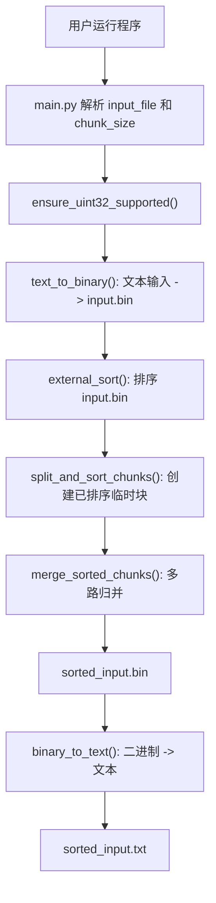
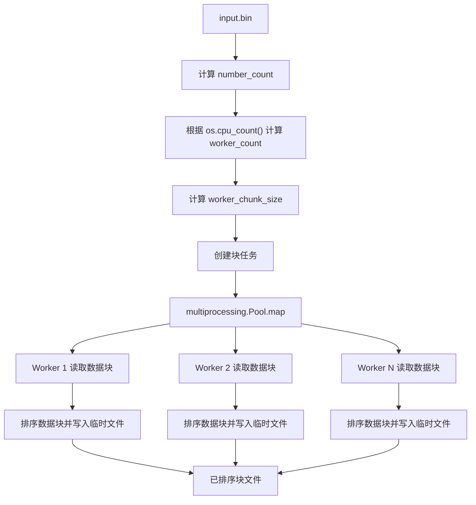
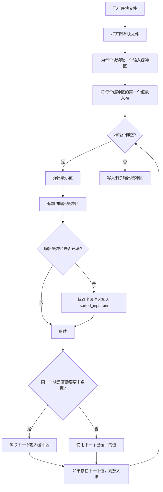

# Homework 01 Sort 中文说明

## 1. 项目目标

本项目用于完成第一次作业：在不能一次性把整个文件加载到内存的情况下，对一个包含 32 位整数的大文件进行排序。

项目使用的核心算法是外部归并排序：

1. 按受限大小分批读取输入数据。
2. 使用所有可用 CPU 核心，在独立进程中排序每个数据块。
3. 将排序后的临时块文件保存到磁盘。
4. 将所有已排序的块文件合并成一个有序二进制文件。
5. 将排序后的二进制结果再转换成便于查看的文本文件。

作业要求描述的是一个包含 32 位整数的二进制文件。本实现额外提供了一个文本输入包装层：用户提供包含数字的文本文件，程序先把它转换成 `input.bin`，然后排序这个二进制文件，最后生成 `sorted_input.bin` 和 `sorted_input.txt`。

## 2. 项目结构

```text
homework_01_Sort/
|-- __init__.py
|-- main.py
|-- external_sort.py
|-- binary_io.py
|-- text_io.py
|-- pyproject.toml
|-- README.md
|-- random_numbers.txt
|-- input.bin
|-- sorted_input.bin
`-- sorted_input.txt
```

### 文件职责

| 文件 | 作用 |
| --- | --- |
| `__init__.py` | 标记该目录是 `homework_01_Sort` Python 包。 |
| `main.py` | 程序入口。负责解析参数并启动完整流程。 |
| `external_sort.py` | 主要排序逻辑。负责切分二进制文件、并行排序数据块、合并数据块。 |
| `binary_io.py` | 底层二进制读写工具，用于处理 32 位无符号整数。 |
| `text_io.py` | 文本文件与二进制整数文件之间的转换工具。 |
| `pyproject.toml` | Python 包配置文件。 |
| `random_numbers.txt` | 示例文本输入数据。 |
| `input.bin` | 程序运行后生成的二进制输入文件。 |
| `sorted_input.bin` | 程序运行后生成的排序后二进制输出文件。 |
| `sorted_input.txt` | 程序运行后生成的排序后文本输出文件。 |

## 3. 运行流程

程序从 `main.py` 开始执行。它不会直接排序文本文件，而是先把文本数字转换成紧凑的二进制格式。



主要数据流如下：


## 4. 模块设计

### 4.1 `main.py`

`main.py` 负责整体流程编排。它将用户交互部分和排序算法部分分离开。

重要常量：

```python
INPUT_BINARY_NAME = "input.bin"
OUTPUT_BINARY_NAME = "sorted_input.bin"
OUTPUT_TEXT_NAME = "sorted_input.txt"
```

这些常量定义了程序生成的文件名。生成文件会放在输入文本文件所在的同一目录中。

主要步骤：

```python
args = parse_args()
ensure_uint32_supported()
input_text_path = Path(args.input_file).resolve()
```

程序读取两个命令行参数：

1. `input_file`：包含无符号 32 位整数的文本文件路径。
2. `chunk_size`：同一时间允许加载到内存中的最大数值数量。

然后构造输出路径：

```python
working_dir = input_text_path.parent
input_binary_path = working_dir / INPUT_BINARY_NAME
output_binary_path = working_dir / OUTPUT_BINARY_NAME
output_text_path = working_dir / OUTPUT_TEXT_NAME
```

最后执行三个主要阶段：

```python
text_to_binary(input_text_path, input_binary_path)
external_sort(input_binary_path, output_binary_path, args.chunk_size)
binary_to_text(output_binary_path, output_text_path)
```

该模块不关心数据块如何排序或合并。它只负责按照正确顺序连接各个模块。

### 4.2 `binary_io.py`

`binary_io.py` 是底层二进制 I/O 模块。

项目使用：

```python
UINT32_TYPE_CODE = "I"
UINT32_SIZE = 4
```

`array("I")` 用紧凑的二进制形式存储无符号整数。`ensure_uint32_supported()` 会检查当前平台上一个元素是否确实占用 4 个字节：

```python
if array(UINT32_TYPE_CODE).itemsize != UINT32_SIZE:
    raise RuntimeError("array('I') is not 32-bit on this platform.")
```

这个检查很重要，因为作业要求使用 32 位整数。如果当前平台格式不匹配，程序会提前停止。

`read_uint32_chunk(file, count)` 从当前文件位置最多读取 `count` 个数字。在到达文件末尾时，它可能返回少于 `count` 个数字。

`write_uint32_chunk(file, numbers)` 将一个 `array("I")` 直接写入二进制文件。

该模块同时被 `text_io.py` 和 `external_sort.py` 使用。

### 4.3 `text_io.py`

`text_io.py` 是转换辅助模块。

`text_to_binary()` 从文本文件中读取数字，检查它们是否合法，然后以无符号 32 位整数的形式写入二进制文件：

```python
number = int(token)
if number < 0 or number > 2**32 - 1:
    raise ValueError(f"Number is out of uint32 range: {number}")
```

它使用默认大小为 `100_000` 的内部缓冲区。这样可以避免每次只写一个数字，从而提高 I/O 效率。

`binary_to_text()` 分块读取排序后的二进制文件，并把每个数字按行写入文本文件。

该模块不是纯外部排序算法的一部分，但它让程序更容易测试和查看结果。

### 4.4 `external_sort.py`

`external_sort.py` 包含主要算法。

对外使用的函数是：

```python
external_sort(input_path, output_path, chunk_size)
```

它会检查 `chunk_size`，在输入文件附近创建临时目录，排序数据块，计算归并缓冲区大小，然后合并所有块文件：

```python
with TemporaryDirectory(dir=input_path.parent) as temp_dir_name:
    temp_dir = Path(temp_dir_name)
    chunk_paths = split_and_sort_chunks(input_path, chunk_size, temp_dir)
    input_buffer_size, output_buffer_size = calculate_merge_buffer_sizes(
        chunk_size=chunk_size,
        chunk_count=len(chunk_paths),
    )
    merge_sorted_chunks(chunk_paths, output_path, input_buffer_size, output_buffer_size)
```

排序结束后，临时目录会被自动删除。

## 5. 外部排序设计

### 5.1 统计数字数量

在切分文件之前，程序会检查二进制文件大小：

```python
file_size = input_path.stat().st_size
if file_size % UINT32_SIZE != 0:
    raise ValueError("Input file size is not divisible by uint32 size.")
return file_size // UINT32_SIZE
```

这样可以防止算法处理损坏的二进制文件。合法文件必须只包含完整的 4 字节整数。

### 5.2 切分并排序数据块

`split_and_sort_chunks()` 决定使用多少个工作进程：

```python
worker_count = min(os.cpu_count() or 1, chunk_size, number_count)
worker_chunk_size = max(1, chunk_size // worker_count)
```

这满足了作业中使用可用 CPU 核心的要求。同时，它会让总加载数值数量接近用户传入的 `chunk_size` 限制。

示例：

```text
chunk_size = 1,000,000
cpu_count = 8
worker_chunk_size = 125,000
```

每个工作进程一次排序一个数据块。任务通过 `multiprocessing.Pool.map()` 分发：

```python
with Pool(processes=worker_count) as pool:
    chunk_paths = pool.map(sort_chunk_by_index, tasks)
```

每个工作进程都会执行 `sort_chunk_by_index()`：

```python
input_file.seek(offset)
numbers = read_uint32_chunk(input_file, chunk_size)
sorted_numbers = sort_numbers(numbers)
write_uint32_chunk(chunk_file, sorted_numbers)
```

这个阶段的结果是一组已经排好序的临时二进制块文件。

数据块排序流程：



### 5.3 多路归并

当所有块文件都单独排好序之后，`merge_sorted_chunks()` 会把它们合并成一个输出文件。

它会打开每个块文件，并从每个文件中读取一个小缓冲区：

```python
buffer = read_uint32_chunk(input_file, input_buffer_size)
```

每个非空缓冲区的第一个值会被放入堆中：

```python
heapq.heappush(heap, (buffer[0], file_index))
```

堆会一直给出所有块当前候选值中的最小值。程序执行的过程是：

1. 弹出最小值。
2. 将该值追加到输出缓冲区。
3. 从同一个块中读取下一个值。
4. 将下一个值放回堆中。
5. 当输出缓冲区满时，将其写入文件。

归并流程：



堆中最多只保存每个块的一个当前候选值。因此，归并阶段的内存占用较小。

## 6. 内存控制

用户通过 `chunk_size` 指定同一时间最多允许加载到内存中的数字数量。

在并行块排序阶段：

```python
worker_chunk_size = max(1, chunk_size // worker_count)
```

每个工作进程只加载 `worker_chunk_size` 个值。如果所有工作进程同时运行，总加载数据量会接近 `chunk_size`。

在归并阶段：

```python
input_memory_limit = max(1, chunk_size // 2)
input_buffer_size = max(1, input_memory_limit // chunk_count)
output_buffer_size = max(1, chunk_size - input_buffer_size * chunk_count)
```

大约一半允许内存用于输入缓冲区，剩余部分用于输出缓冲区。这样可以避免把整个临时文件读入内存。

## 7. CPU 使用

排序阶段使用：

```python
os.cpu_count()
```

这使工作进程数量可以动态调整。代码没有硬编码固定数量，例如 4 或 8。在核心数更多的机器上，程序可以使用更多排序进程。在较小的机器上，它也会自动减少进程数。

归并阶段是单进程的，因为多路归并主要涉及有序 I/O 和堆协调。真正计算量较大的局部排序阶段才是并行执行的部分。

## 8. 算法复杂度

设 `n` 为输入文件中的整数数量。

块排序会对所有数字排序一次。总代价大约是：

```text
O(n log m)
```

其中 `m` 是单个工作进程处理的数据块大小。

多路归并会处理每个数字一次，并使用一个包含 `k` 个块的堆：

```text
O(n log k)
```

完整算法复杂度不超过：

```text
O(n log n)
```

这满足作业要求。

## 9. 重要说明

- 输入数字必须是无符号 32 位整数。
- 有效范围是 `0` 到 `4294967295`。
- 生成的二进制文件没有文件头。
- 二进制文件中数字是连续存储的。
- 临时块文件会创建在输入文件所在的同一目录中。
- 排序完成后，临时文件会自动删除。
- 按照作业说明，可以假设磁盘空间足够。

## 10. 设计总结

项目被拆分成几个小模块：

- `main.py` 控制完整流程。
- `text_io.py` 处理文本和二进制之间的转换。
- `binary_io.py` 提供安全的二进制整数 I/O。
- `external_sort.py` 实现外部归并排序。

这种设计把文件格式逻辑、用户交互逻辑和排序逻辑分离开。主算法通过临时文件、有限缓冲区、多进程块排序和基于堆的多路归并，可以在数据量大于内存时完成排序。
