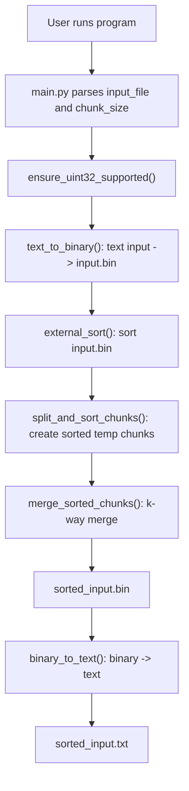
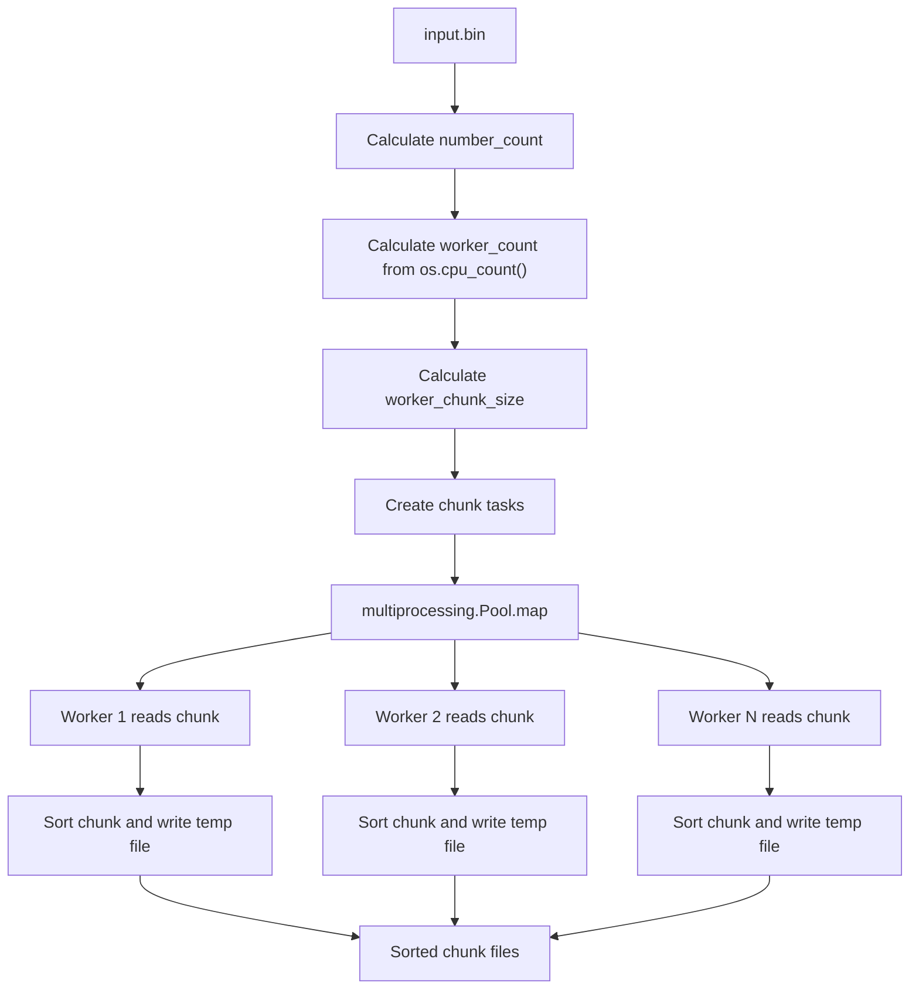
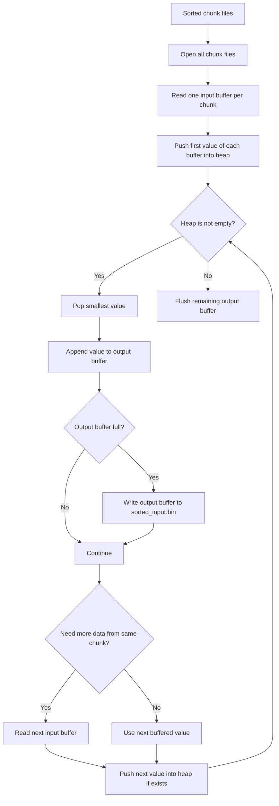

# Homework 01 Sort

## 1. Project Goal

This project solves the first homework task: sort a large file of 32-bit integer
values when the whole file cannot be loaded into memory at once.

The required algorithm is an external merge sort:

1. Read the input data in limited-size parts.
2. Sort each part in a separate process by using all available CPU cores.
3. Save sorted temporary chunk files on disk.
4. Merge all sorted chunks into one sorted binary file.
5. Convert the sorted binary result back to a readable text file.

The homework statement describes a binary file with 32-bit integers. This
implementation adds a text wrapper around that requirement: the user gives a
text file with numbers, the program converts it to `input.bin`, sorts the binary
file, and writes both `sorted_input.bin` and `sorted_input.txt`.

## 2. Project Structure

```text
homework_01_Sort/
|-- __init__.py
|-- main.py
|-- external_sort.py
|-- binary_io.py
|-- text_io.py
|-- pyproject.toml
|-- README.md
|-- random_numbers.txt
|-- input.bin
|-- sorted_input.bin
`-- sorted_input.txt
```

### File Roles

| File | Role |
| --- | --- |
| `__init__.py` | Marks this directory as the `homework_01_Sort` Python package. |
| `main.py` | Program entry point. It parses arguments and starts the full workflow. |
| `external_sort.py` | Main sorting logic. It splits the binary file, sorts chunks in parallel, and merges chunks. |
| `binary_io.py` | Low-level binary reading and writing for 32-bit unsigned integers. |
| `text_io.py` | Converts between text files and binary integer files. |
| `pyproject.toml` | Python package configuration. |
| `random_numbers.txt` | Example text input data. |
| `input.bin` | Generated binary input file after the program runs. |
| `sorted_input.bin` | Generated sorted binary output file after the program runs. |
| `sorted_input.txt` | Generated sorted text output file after the program runs. |

## 3. Runtime Workflow

The program starts from `main.py`. It does not sort the text file directly.
Instead, it converts text numbers into a compact binary format first.



The main data flow is:


## 4. Module Design

### 4.1 `main.py`

`main.py` is responsible for orchestration. It keeps the user interface separate
from the sorting algorithm.

Important constants:

```python
INPUT_BINARY_NAME = "input.bin"
OUTPUT_BINARY_NAME = "sorted_input.bin"
OUTPUT_TEXT_NAME = "sorted_input.txt"
```

These names define the generated files. They are created in the same directory
as the input text file.

Main steps:

```python
args = parse_args()
ensure_uint32_supported()
input_text_path = Path(args.input_file).resolve()
```

The program reads two command-line parameters:

1. `input_file`: path to a text file with unsigned 32-bit integers.
2. `chunk_size`: maximum number of values allowed in memory at the same time.

Then it builds output paths:

```python
working_dir = input_text_path.parent
input_binary_path = working_dir / INPUT_BINARY_NAME
output_binary_path = working_dir / OUTPUT_BINARY_NAME
output_text_path = working_dir / OUTPUT_TEXT_NAME
```

Finally it executes the three main phases:

```python
text_to_binary(input_text_path, input_binary_path)
external_sort(input_binary_path, output_binary_path, args.chunk_size)
binary_to_text(output_binary_path, output_text_path)
```

This module does not know how chunks are sorted or merged. It only connects the
modules in the correct order.

### 4.2 `binary_io.py`

`binary_io.py` is the low-level binary I/O module.

The project uses:

```python
UINT32_TYPE_CODE = "I"
UINT32_SIZE = 4
```

`array("I")` stores unsigned integers in a compact binary form. The function
`ensure_uint32_supported()` checks that one item really uses 4 bytes on the
current platform:

```python
if array(UINT32_TYPE_CODE).itemsize != UINT32_SIZE:
    raise RuntimeError("array('I') is not 32-bit on this platform.")
```

This check is important because the homework requires 32-bit integers. If the
platform does not match this format, the program stops early.

`read_uint32_chunk(file, count)` reads at most `count` numbers from the current
file position. It may return fewer numbers at the end of the file.

`write_uint32_chunk(file, numbers)` writes an `array("I")` directly to a binary
file.

This module is used by both `text_io.py` and `external_sort.py`.

### 4.3 `text_io.py`

`text_io.py` is a conversion helper.

`text_to_binary()` reads numbers from a text file, validates them, and writes
them as unsigned 32-bit values:

```python
number = int(token)
if number < 0 or number > 2**32 - 1:
    raise ValueError(f"Number is out of uint32 range: {number}")
```

It uses an internal buffer with default size `100_000`. This avoids writing one
number at a time and keeps I/O efficient.

`binary_to_text()` reads the sorted binary file in chunks and writes one number
per line into a text file.

This module is not part of the pure external sort algorithm, but it makes the
program easy to test and inspect.

### 4.4 `external_sort.py`

`external_sort.py` contains the main algorithm.

The public function is:

```python
external_sort(input_path, output_path, chunk_size)
```

It validates `chunk_size`, creates a temporary directory near the input file,
sorts chunks, calculates merge buffers, and merges the chunks:

```python
with TemporaryDirectory(dir=input_path.parent) as temp_dir_name:
    temp_dir = Path(temp_dir_name)
    chunk_paths = split_and_sort_chunks(input_path, chunk_size, temp_dir)
    input_buffer_size, output_buffer_size = calculate_merge_buffer_sizes(
        chunk_size=chunk_size,
        chunk_count=len(chunk_paths),
    )
    merge_sorted_chunks(chunk_paths, output_path, input_buffer_size, output_buffer_size)
```

The temporary directory is automatically deleted after sorting finishes.

## 5. External Sort Design

### 5.1 Count Numbers

Before splitting the file, the program checks the binary file size:

```python
file_size = input_path.stat().st_size
if file_size % UINT32_SIZE != 0:
    raise ValueError("Input file size is not divisible by uint32 size.")
return file_size // UINT32_SIZE
```

This protects the algorithm from broken binary files. A valid file must contain
only complete 4-byte integer values.

### 5.2 Split and Sort Chunks

`split_and_sort_chunks()` decides how many worker processes to use:

```python
worker_count = min(os.cpu_count() or 1, chunk_size, number_count)
worker_chunk_size = max(1, chunk_size // worker_count)
```

This follows the homework requirement to use available CPU cores. At the same
time, it keeps the total number of loaded values near the user-provided
`chunk_size` limit.

Example:

```text
chunk_size = 1,000,000
cpu_count = 8
worker_chunk_size = 125,000
```

Each worker process sorts one chunk at a time. The work items are passed into
`multiprocessing.Pool.map()`:

```python
with Pool(processes=worker_count) as pool:
    chunk_paths = pool.map(sort_chunk_by_index, tasks)
```

Each worker executes `sort_chunk_by_index()`:

```python
input_file.seek(offset)
numbers = read_uint32_chunk(input_file, chunk_size)
sorted_numbers = sort_numbers(numbers)
write_uint32_chunk(chunk_file, sorted_numbers)
```

The result of this phase is a list of sorted temporary binary files.

Chunk sorting flow:



### 5.3 K-Way Merge

After all chunks are individually sorted, `merge_sorted_chunks()` merges them
into one output file.

It opens every chunk file and reads a small buffer from each one:

```python
buffer = read_uint32_chunk(input_file, input_buffer_size)
```

The first value from each non-empty buffer is pushed into a heap:

```python
heapq.heappush(heap, (buffer[0], file_index))
```

The heap always gives the smallest current value across all chunks. The program:

1. Pops the smallest value.
2. Appends it to the output buffer.
3. Reads the next value from the same chunk.
4. Pushes that next value into the heap.
5. Flushes the output buffer when it is full.

Merge flow:



The heap contains at most one active value per chunk. This keeps the merge stage
memory usage small.

## 6. Memory Control

The user gives `chunk_size` as the maximum number of values that should be
loaded into memory at the same time.

During parallel chunk sorting:

```python
worker_chunk_size = max(1, chunk_size // worker_count)
```

Each worker loads only `worker_chunk_size` values. If all workers run at the same
time, the total loaded data is close to `chunk_size`.

During merge:

```python
input_memory_limit = max(1, chunk_size // 2)
input_buffer_size = max(1, input_memory_limit // chunk_count)
output_buffer_size = max(1, chunk_size - input_buffer_size * chunk_count)
```

About half of the allowed memory is used for input buffers. The rest is used for
the output buffer. This avoids reading whole temporary files into memory.

## 7. CPU Usage

The sorting phase uses:

```python
os.cpu_count()
```

This makes the number of worker processes dynamic. The code does not hard-code a
fixed number such as 4 or 8. On a machine with more cores, the program can use
more sorting workers. On a smaller machine, it automatically uses fewer workers.

The merge phase is single-process because k-way merge is mostly ordered I/O and
heap coordination. The expensive local sorting work is the part that runs in
parallel.

## 8. Algorithm Complexity

Let `n` be the number of integers in the input file.

Chunk sorting sorts all numbers once. The total cost is about:

```text
O(n log m)
```

where `m` is the chunk size handled by a worker.

K-way merge processes every number once and uses a heap with `k` chunks:

```text
O(n log k)
```

The full algorithm is within:

```text
O(n log n)
```

This satisfies the homework requirement.

## 9. Important Notes

- Input numbers must be unsigned 32-bit integers.
- Valid range is from `0` to `4294967295`.
- The generated binary file has no header.
- The binary file stores numbers continuously.
- Temporary chunk files are created in the same directory as the input file.
- Temporary files are removed automatically after the sort is complete.
- Disk space is assumed to be enough, as allowed by the homework statement.

## 10. Design Summary

The project separates the program into small modules:

- `main.py` controls the full workflow.
- `text_io.py` handles text and binary conversion.
- `binary_io.py` provides safe binary integer I/O.
- `external_sort.py` implements external merge sort.

This design keeps file format logic, user interaction, and sorting logic
separate. The main algorithm can sort data larger than memory by using temporary
files, limited buffers, multiprocessing chunk sorting, and heap-based k-way
merge.
