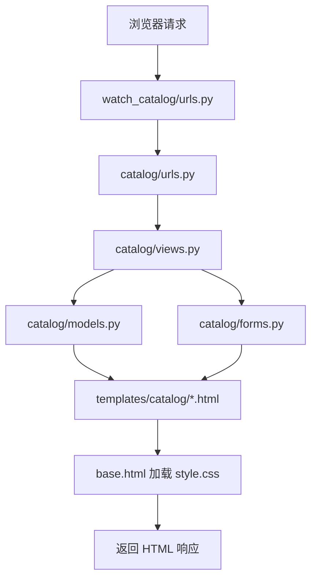
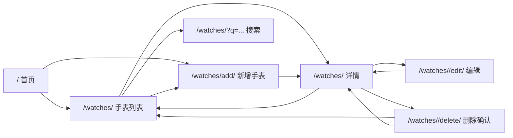
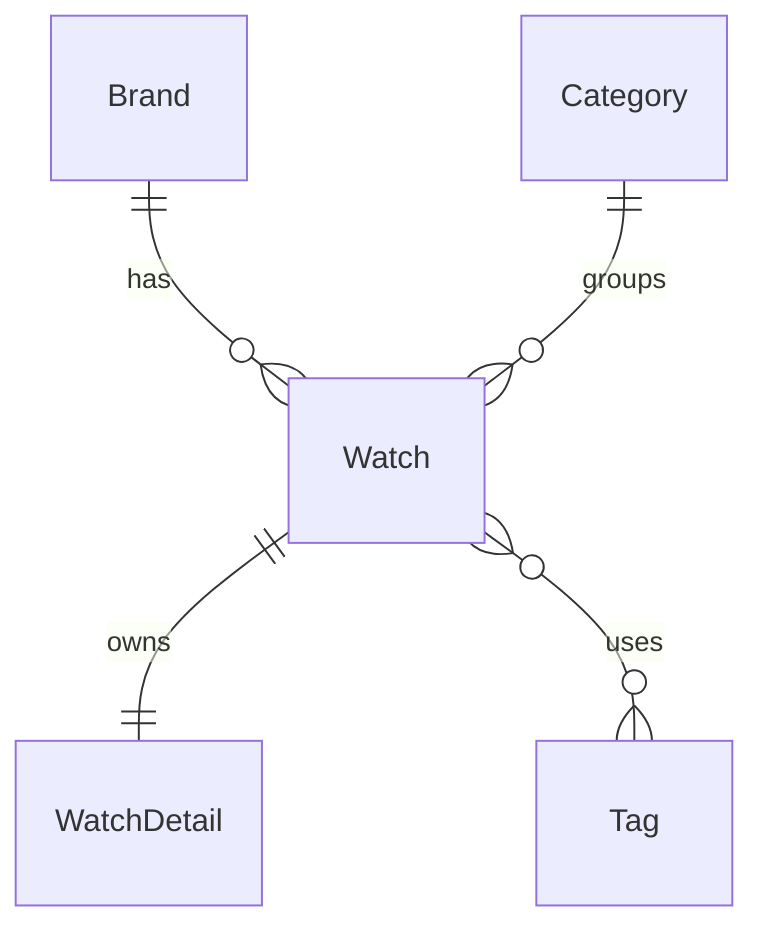

# 个人手表收藏目录系统

这是一个 Django Web 项目，主题是个人手表收藏目录。项目对应作业要求：开发一个对象目录系统，包含结构化数据、模型关系、多页面展示、自定义样式，以及通过网页表单与数据库交互。

当前版本支持：

- 首页展示最新手表
- 手表列表页
- 按手表名称、品牌名称、分类名称搜索
- 手表详情页
- 新增手表表单
- 编辑手表表单
- 删除确认页
- 通过 Django Admin 管理所有模型
- 自定义 CSS 页面样式

## 项目结构

```text
homework_02_Django/
├── manage.py
├── main.py
├── pyproject.toml
├── db.sqlite3
├── watch_catalog/
│   ├── __init__.py
│   ├── settings.py
│   ├── urls.py
│   ├── asgi.py
│   └── wsgi.py
├── catalog/
│   ├── __init__.py
│   ├── apps.py
│   ├── models.py
│   ├── forms.py
│   ├── views.py
│   ├── urls.py
│   ├── admin.py
│   ├── tests.py
│   └── migrations/
│       ├── __init__.py
│       └── 0001_initial.py
├── templates/catalog/
│   ├── base.html
│   ├── home.html
│   ├── watch_list.html
│   ├── watch_detail.html
│   ├── watch_form.html
│   └── watch_confirm_delete.html
└── static/catalog/css/
    └── style.css
```

## Django 主要模块

| 模块 | 文件 | 作用 |
| --- | --- | --- |
| 项目配置 | `watch_catalog/settings.py` | 配置应用、模板、SQLite 数据库、静态文件 |
| 项目路由 | `watch_catalog/urls.py` | 将后台请求交给 Django Admin，将普通页面请求交给 `catalog.urls` |
| 应用路由 | `catalog/urls.py` | 定义目录应用的页面地址 |
| 模型 | `catalog/models.py` | 定义数据库表和模型关系 |
| 表单 | `catalog/forms.py` | 定义手表表单和验证规则 |
| 视图 | `catalog/views.py` | 处理页面请求、ORM 查询、表单保存、搜索、编辑、删除 |
| 模板 | `templates/catalog/*.html` | 渲染 HTML 页面 |
| 静态文件 | `static/catalog/css/style.css` | 提供自定义 CSS |
| 后台管理 | `catalog/admin.py` | 注册模型并配置后台列表、搜索、筛选等功能 |

## 模块联动流程



页面流程：



## 数据模型设计

项目中共有 5 个模型：

| 模型 | 作用 |
| --- | --- |
| `Brand` | 保存手表品牌信息 |
| `Category` | 保存手表分类信息 |
| `Tag` | 保存可复用标签 |
| `Watch` | 目录系统的核心对象 |
| `WatchDetail` | 与某只手表一对一关联的技术参数 |

模型关系图：



作业要求实现一对一、一对多、多对多三种关系，当前项目已经全部实现：

| 要求关系 | Django 字段 | 代码位置 | 含义 |
| --- | --- | --- | --- |
| 一对一 | `OneToOneField` | `WatchDetail.watch` | 一只手表对应一份详细参数 |
| 一对多 | `ForeignKey` | `Watch.brand` | 一个品牌可以有多只手表 |
| 一对多 | `ForeignKey` | `Watch.category` | 一个分类可以有多只手表 |
| 多对多 | `ManyToManyField` | `Watch.tags` | 一只手表可以有多个标签 |

模型中也使用了多种字段类型：

- `CharField`：短文本
- `TextField`：长文本
- `IntegerField`：整数
- `DecimalField` 和 `FloatField`：小数
- `DateField`：日期
- `BooleanField`：布尔值
- `TextChoices`：枚举选项
- `DateTimeField(auto_now_add=True)`：创建时间

## 已实现页面

| URL | 视图 | 模板 | 作用 |
| --- | --- | --- | --- |
| `/` | `home` | `home.html` | 展示项目简介和最新手表 |
| `/watches/` | `watch_list` | `watch_list.html` | 以卡片网格展示全部手表 |
| `/watches/?q=...` | `watch_list` | `watch_list.html` | 搜索手表名称、品牌名称、分类名称 |
| `/watches/<id>` | `watch_detail` | `watch_detail.html` | 展示单只手表的完整信息 |
| `/watches/add/` | `watch_create` | `watch_form.html` | 新增手表 |
| `/watches/<id>/edit/` | `watch_update` | `watch_form.html` | 编辑已有手表 |
| `/watches/<id>/delete/` | `watch_delete` | `watch_confirm_delete.html` | 确认并删除手表 |
| `/admin/` | Django Admin | 内置后台 | 管理所有数据库模型 |

## 表单与数据库交互

`WatchForm` 是基于 `Watch` 模型的 Django `ModelForm`。

表单包含以下字段：

- `name`
- `brand`
- `category`
- `movement_type`
- `price`
- `purchase_date`
- `is_in_collection`
- `description`
- `tags`

表单包含自定义验证：

- 手表名称至少 2 个字符
- 价格不能为负数

用户提交合法数据后：

1. 视图调用 `form.is_valid()`
2. Django 执行内置验证和自定义验证
3. 视图调用 `form.save()`
4. 数据保存到 `db.sqlite3`
5. 用户跳转到手表详情页

当前版本的公开新增/编辑表单只编辑 `Watch` 模型。`WatchDetail` 不在公开表单中编辑，而是在 Django Admin 中通过 `WatchDetailInline` 和手表一起维护。

## 关键代码说明

### 项目路由

`watch_catalog/urls.py`

```python
urlpatterns = [
    path("admin/", admin.site.urls),
    path("", include("catalog.urls")),
]
```

这段代码把 `/admin/` 交给 Django Admin，把普通页面请求交给 `catalog` 应用。

### 应用路由

`catalog/urls.py`

```python
urlpatterns = [
    path("", views.home, name="home"),
    path("watches/", views.watch_list, name="watch_list"),
    path("watches/add/", views.watch_create, name="watch_create"),
    path("watches/<int:watch_id>", views.watch_detail, name="watch_detail"),
    path("watches/<int:watch_id>/edit/", views.watch_update, name="watch_update"),
    path("watches/<int:watch_id>/delete/", views.watch_delete, name="watch_delete"),
]
```

每个路由都把一个清晰的 URL 连接到一个视图函数。`name` 可以在模板中通过 `` 生成链接。

### 模型关系

`catalog/models.py`

```python
class Watch(models.Model):
    brand = models.ForeignKey(Brand, on_delete=models.CASCADE)
    category = models.ForeignKey(Category, on_delete=models.CASCADE)
    tags = models.ManyToManyField(Tag, blank=True)


class WatchDetail(models.Model):
    watch = models.OneToOneField(Watch, on_delete=models.CASCADE)
```

这是本次作业最重要的模型关系代码，展示了一对多、多对多、一对一三种关系。

### 机芯类型枚举

`catalog/models.py`

```python
class MovementType(models.TextChoices):
    AUTOMATIC = "AUTOMATIC", "Automatic"
    MANUAL = "MANUAL", "Manual"
    QUARTZ = "QUARTZ", "Quartz"
    SOLAR = "SOLAR", "Solar"
    SMART = "SMART", "Smart"
```

这段代码为 `Watch.movement_type` 提供固定选项。数据库保存稳定值，模板中可以用 `get_movement_type_display` 显示可读文本。

### 搜索和列表视图

`catalog/views.py`

```python
def watch_list(request):
    query = request.GET.get("q", "")

    watches = (
        Watch.objects.select_related("brand", "category")
        .prefetch_related("tags")
        .order_by("name")
    )

    if query:
        watches = watches.filter(
            name__icontains=query
        ) | watches.filter(
            brand__name__icontains=query
        ) | watches.filter(
            category__name__icontains=query
        )

    return render(
        request,
        "catalog/watch_list.html",
        {"watches": watches, "query": query},
    )
```

该视图读取全部手表，预加载关联模型；如果 URL 中有 `q` 参数，就按手表名称、品牌名称、分类名称搜索。

### 详情视图

`catalog/views.py`

```python
def watch_detail(request, watch_id):
    watch = get_object_or_404(
        Watch.objects.select_related(
            "brand", "category", "watchdetail"
        ).prefetch_related("tags"),
        id=watch_id,
    )
```

`get_object_or_404` 会在 ID 存在时返回手表；如果 ID 不存在，Django 会返回 404 页面。

### 新增视图

`catalog/views.py`

```python
def watch_create(request):
    if request.method == "POST":
        form = WatchForm(request.POST)
        if form.is_valid():
            watch = form.save()
            return redirect("catalog:watch_detail", watch_id=watch.id)
    else:
        form = WatchForm()
```

GET 请求显示空表单；POST 请求验证表单，保存新手表，并跳转到详情页。

### 编辑视图

`catalog/views.py`

```python
def watch_update(request, watch_id):
    watch = get_object_or_404(Watch, id=watch_id)

    if request.method == "POST":
        form = WatchForm(request.POST, instance=watch)
        if form.is_valid():
            form.save()
            return redirect("catalog:watch_detail", watch_id=watch.id)
    else:
        form = WatchForm(instance=watch)
```

编辑视图复用 `WatchForm`，但传入 `instance=watch`。这样表单会更新已有记录，而不是创建新记录。

### 删除视图

`catalog/views.py`

```python
def watch_delete(request, watch_id):
    watch = get_object_or_404(Watch, id=watch_id)

    if request.method == "POST":
        watch.delete()
        return redirect("catalog:watch_list")

    return render(request, "catalog/watch_confirm_delete.html", {"watch": watch})
```

GET 请求只显示确认页；真正删除只在 POST 请求中执行。

### 表单验证

`catalog/forms.py`

```python
def clean_price(self):
    price = self.cleaned_data["price"]

    if price < 0:
        raise forms.ValidationError("Price cannot be negative.")

    return price
```

自定义 `clean_...` 方法可以在 Django 内置字段验证之外增加业务规则。

### 共享表单模板

`templates/catalog/watch_form.html`

```django
<h2>{{ title }}</h2>
<form method="post">
    
    {{ form.as_p }}
    <button type="submit">{{ submit_text }}</button>
</form>
```

新增和编辑共用同一个模板。页面标题和按钮文字由视图传入。

### 静态 CSS

`templates/catalog/base.html`

```django

<link rel="stylesheet" href="" />
```

所有页面都继承 `base.html`，因此都会加载同一份自定义 CSS。

## 当前限制

- 公开新增/编辑表单只编辑 `Watch` 模型，不编辑 `WatchDetail`。
- `Brand`、`Category`、`Tag` 需要提前存在，才能在手表表单中选择。
- `catalog/tests.py` 文件存在，但还没有自动化测试。
- `db.sqlite3` 是本地 SQLite 数据库文件，新增、编辑、删除、迁移数据时都会变化。

## 运行方式

在仓库根目录执行：

```bash
uv sync
```

进入 Django 项目：

```bash
cd src/homework_02_Django
```

执行数据库迁移：

```bash
uv run python manage.py migrate
```

启动开发服务器：

```bash
uv run python manage.py runserver
```

打开：

```text
http://127.0.0.1:8000/
```

## 演示检查清单

1. 展示项目结构：`watch_catalog`、`catalog`、`templates`、`static`。
2. 解释 5 个模型和三种关系。
3. 打开 `/watches/` 展示卡片网格。
4. 按手表、品牌或分类搜索。
5. 打开一只手表的详情页。
6. 使用表单新增手表。
7. 编辑手表。
8. 通过确认页删除手表。
9. 展示自定义 CSS 来自 `static/catalog/css/style.css`。
