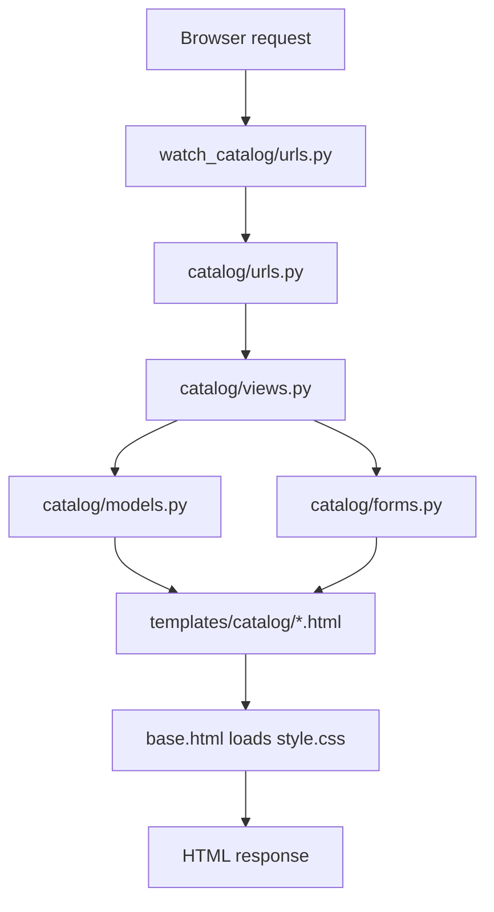
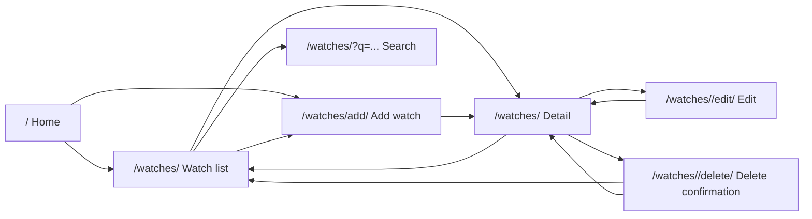
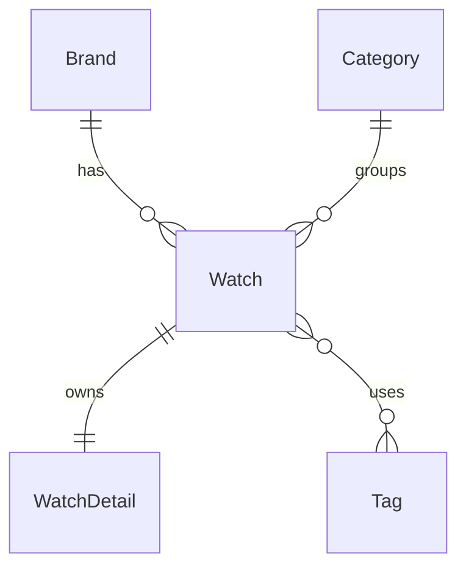

# Personal Watch Collection Catalog

This Django project is a personal watch catalog. It was built for the homework requirement to create a web catalog with structured data, related models, multiple pages, custom styles, and database interaction through web forms.

The current version supports:

- home page with latest watches
- watch list page
- search by watch name, brand name, or category name
- watch detail page
- add watch form
- edit watch form
- delete confirmation page
- Django Admin management for all models
- custom CSS layout and styling

## Project Structure

```text
homework_02_Django/
├── manage.py
├── main.py
├── pyproject.toml
├── db.sqlite3
├── watch_catalog/
│   ├── __init__.py
│   ├── settings.py
│   ├── urls.py
│   ├── asgi.py
│   └── wsgi.py
├── catalog/
│   ├── __init__.py
│   ├── apps.py
│   ├── models.py
│   ├── forms.py
│   ├── views.py
│   ├── urls.py
│   ├── admin.py
│   ├── tests.py
│   └── migrations/
│       ├── __init__.py
│       └── 0001_initial.py
├── templates/catalog/
│   ├── base.html
│   ├── home.html
│   ├── watch_list.html
│   ├── watch_detail.html
│   ├── watch_form.html
│   └── watch_confirm_delete.html
└── static/catalog/css/
    └── style.css
```

## Main Django Parts

| Part | Files | Purpose |
| --- | --- | --- |
| Project settings | `watch_catalog/settings.py` | Configures installed apps, templates, SQLite, and static files |
| Project URLs | `watch_catalog/urls.py` | Sends admin requests to Django Admin and site requests to `catalog.urls` |
| App URLs | `catalog/urls.py` | Defines page routes for the catalog app |
| Models | `catalog/models.py` | Defines database tables and relationships |
| Forms | `catalog/forms.py` | Defines the watch form and validation rules |
| Views | `catalog/views.py` | Handles page requests, ORM queries, form saving, search, edit, and delete |
| Templates | `templates/catalog/*.html` | Renders HTML pages |
| Static files | `static/catalog/css/style.css` | Provides custom CSS |
| Admin | `catalog/admin.py` | Registers models and improves admin list/search behavior |

## Module Flow



Page flow:



## Data Model Design

The project has 5 models:

| Model | Purpose |
| --- | --- |
| `Brand` | Stores watch brand information |
| `Category` | Stores watch category information |
| `Tag` | Stores reusable tags |
| `Watch` | Main catalog item |
| `WatchDetail` | One-to-one technical details for a watch |

Relationship diagram:



The homework requires all three relationship types. They are implemented as follows:

| Required relationship | Django field | Code location | Meaning |
| --- | --- | --- | --- |
| One-to-one | `OneToOneField` | `WatchDetail.watch` | One watch has one detail record |
| One-to-many | `ForeignKey` | `Watch.brand` | One brand can have many watches |
| One-to-many | `ForeignKey` | `Watch.category` | One category can have many watches |
| Many-to-many | `ManyToManyField` | `Watch.tags` | One watch can have many tags |

The models also use different field types:

- `CharField` for short text
- `TextField` for long text
- `IntegerField` for whole numbers
- `DecimalField` and `FloatField` for decimal values
- `DateField` for dates
- `BooleanField` for true or false values
- `TextChoices` for movement type options
- `DateTimeField(auto_now_add=True)` for creation time

## Implemented Pages

| URL | View | Template | Purpose |
| --- | --- | --- | --- |
| `/` | `home` | `home.html` | Shows a short project intro and latest watches |
| `/watches/` | `watch_list` | `watch_list.html` | Shows all watches in a card grid |
| `/watches/?q=...` | `watch_list` | `watch_list.html` | Searches watch name, brand name, and category name |
| `/watches/<id>` | `watch_detail` | `watch_detail.html` | Shows full watch information |
| `/watches/add/` | `watch_create` | `watch_form.html` | Adds a new watch |
| `/watches/<id>/edit/` | `watch_update` | `watch_form.html` | Edits an existing watch |
| `/watches/<id>/delete/` | `watch_delete` | `watch_confirm_delete.html` | Confirms and deletes a watch |
| `/admin/` | Django Admin | built-in admin | Manages all database models |

## Form and Database Interaction

`WatchForm` is a Django `ModelForm` for the `Watch` model.

The form includes these fields:

- `name`
- `brand`
- `category`
- `movement_type`
- `price`
- `purchase_date`
- `is_in_collection`
- `description`
- `tags`

The form validates:

- watch name must contain at least 2 characters
- price cannot be negative

When valid data is submitted:

1. the view calls `form.is_valid()`
2. Django runs built-in and custom validation
3. the view calls `form.save()`
4. the data is saved to `db.sqlite3`
5. the user is redirected to the watch detail page

`WatchDetail` is not edited by the public web form in the current version. It is managed through Django Admin, where `WatchDetailInline` allows detail records to be edited together with a watch.

## Important Code Points

### Project URL Routing

`watch_catalog/urls.py`

```python
urlpatterns = [
    path("admin/", admin.site.urls),
    path("", include("catalog.urls")),
]
```

This connects Django Admin to `/admin/` and sends all normal site pages to the `catalog` app.

### App URL Routing

`catalog/urls.py`

```python
urlpatterns = [
    path("", views.home, name="home"),
    path("watches/", views.watch_list, name="watch_list"),
    path("watches/add/", views.watch_create, name="watch_create"),
    path("watches/<int:watch_id>", views.watch_detail, name="watch_detail"),
    path("watches/<int:watch_id>/edit/", views.watch_update, name="watch_update"),
    path("watches/<int:watch_id>/delete/", views.watch_delete, name="watch_delete"),
]
```

Each route maps a readable URL to one view function. The route names are used in templates with ``.

### Model Relationships

`catalog/models.py`

```python
class Watch(models.Model):
    brand = models.ForeignKey(Brand, on_delete=models.CASCADE)
    category = models.ForeignKey(Category, on_delete=models.CASCADE)
    tags = models.ManyToManyField(Tag, blank=True)


class WatchDetail(models.Model):
    watch = models.OneToOneField(Watch, on_delete=models.CASCADE)
```

This is the main homework model requirement. It shows one-to-many, many-to-many, and one-to-one relationships.

### Movement Type Choices

`catalog/models.py`

```python
class MovementType(models.TextChoices):
    AUTOMATIC = "AUTOMATIC", "Automatic"
    MANUAL = "MANUAL", "Manual"
    QUARTZ = "QUARTZ", "Quartz"
    SOLAR = "SOLAR", "Solar"
    SMART = "SMART", "Smart"
```

This gives fixed choices for `Watch.movement_type`. The database stores stable values, and the template can show readable labels with `get_movement_type_display`.

### Search and List View

`catalog/views.py`

```python
def watch_list(request):
    query = request.GET.get("q", "")

    watches = (
        Watch.objects.select_related("brand", "category")
        .prefetch_related("tags")
        .order_by("name")
    )

    if query:
        watches = watches.filter(
            name__icontains=query
        ) | watches.filter(
            brand__name__icontains=query
        ) | watches.filter(
            category__name__icontains=query
        )

    return render(
        request,
        "catalog/watch_list.html",
        {"watches": watches, "query": query},
    )
```

This view reads all watches, optimizes related model loading, applies search when `q` exists, and passes data to the list template.

### Detail View

`catalog/views.py`

```python
def watch_detail(request, watch_id):
    watch = get_object_or_404(
        Watch.objects.select_related(
            "brand", "category", "watchdetail"
        ).prefetch_related("tags"),
        id=watch_id,
    )
```

`get_object_or_404` returns a watch when the ID exists. If the ID does not exist, Django returns a 404 page.

### Create View

`catalog/views.py`

```python
def watch_create(request):
    if request.method == "POST":
        form = WatchForm(request.POST)
        if form.is_valid():
            watch = form.save()
            return redirect("catalog:watch_detail", watch_id=watch.id)
    else:
        form = WatchForm()
```

This view shows an empty form for GET requests. For POST requests, it validates the form, saves a new watch, and redirects to the detail page.

### Update View

`catalog/views.py`

```python
def watch_update(request, watch_id):
    watch = get_object_or_404(Watch, id=watch_id)

    if request.method == "POST":
        form = WatchForm(request.POST, instance=watch)
        if form.is_valid():
            form.save()
            return redirect("catalog:watch_detail", watch_id=watch.id)
    else:
        form = WatchForm(instance=watch)
```

This view reuses `WatchForm`, but passes `instance=watch`. This means the form edits an existing row instead of creating a new one.

### Delete View

`catalog/views.py`

```python
def watch_delete(request, watch_id):
    watch = get_object_or_404(Watch, id=watch_id)

    if request.method == "POST":
        watch.delete()
        return redirect("catalog:watch_list")

    return render(request, "catalog/watch_confirm_delete.html", {"watch": watch})
```

GET only shows the confirmation page. The actual delete happens only after a POST request.

### Form Validation

`catalog/forms.py`

```python
def clean_price(self):
    price = self.cleaned_data["price"]

    if price < 0:
        raise forms.ValidationError("Price cannot be negative.")

    return price
```

Custom `clean_...` methods add business validation on top of Django's built-in field validation.

### Shared Form Template

`templates/catalog/watch_form.html`

```django
<h2>{{ title }}</h2>
<form method="post">
    
    {{ form.as_p }}
    <button type="submit">{{ submit_text }}</button>
</form>
```

The same template is used for both add and edit pages. The view controls the page title and submit button text.

### Static CSS

`templates/catalog/base.html`

```django

<link rel="stylesheet" href="" />
```

All pages extend `base.html`, so all pages load the same custom stylesheet.

## Current Limitations

- The public add/edit form edits only the `Watch` model, not `WatchDetail`.
- `Brand`, `Category`, and `Tag` records must already exist before they can be selected in the watch form.
- `catalog/tests.py` exists but does not contain automated tests yet.
- `db.sqlite3` is a local SQLite database file. It changes when data is added, edited, deleted, or migrated.

## How to Run

From the repository root:

```bash
uv sync
```

Enter the Django project:

```bash
cd src/homework_02_Django
```

Run migrations:

```bash
uv run python manage.py migrate
```

Start the development server:

```bash
uv run python manage.py runserver
```

Open:

```text
http://127.0.0.1:8000/
```

## Quick Demo Checklist

1. Show the project structure: `watch_catalog`, `catalog`, `templates`, and `static`.
2. Explain the 5 models and the three relationship types.
3. Open `/watches/` and show the card grid.
4. Search by watch, brand, or category.
5. Open a watch detail page.
6. Add a new watch with the form.
7. Edit the watch.
8. Delete the watch through the confirmation page.
9. Show that custom CSS is loaded from `static/catalog/css/style.css`.
