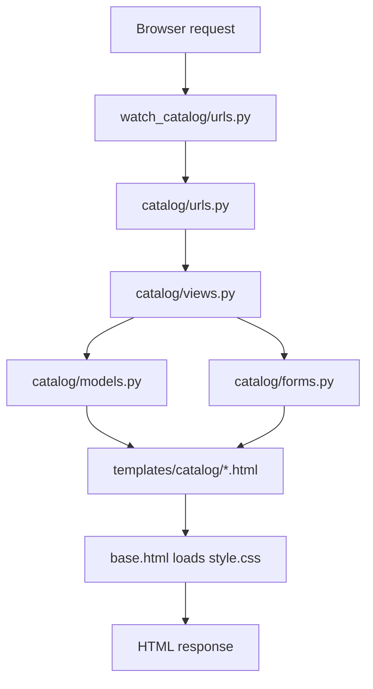
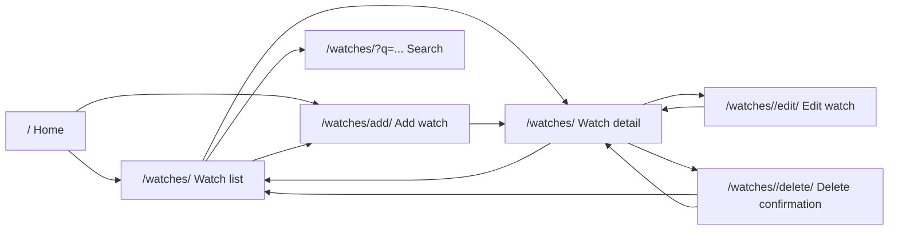
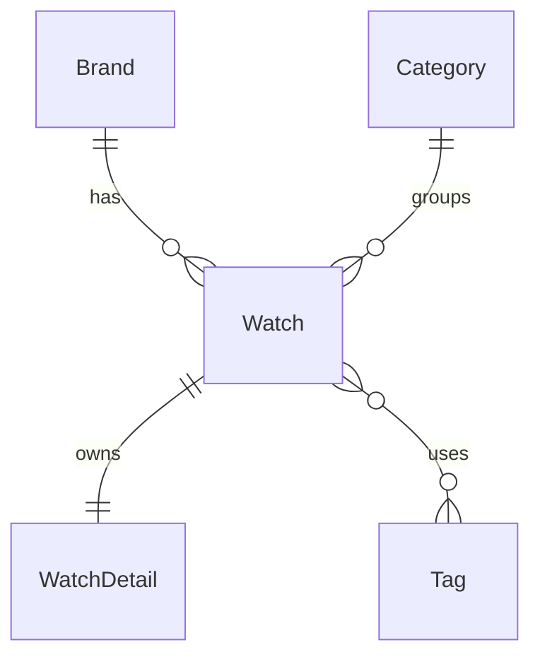

# Personal Watch Collection Catalog

This is a Django web project for a personal watch catalog. It lets users view a watch collection, search watches, open watch details, add new watches with a web form, edit existing watches, and delete watches after confirmation.

## Project Structure

```text
homework_02_Django/
├── manage.py
├── main.py
├── pyproject.toml
├── db.sqlite3
├── watch_catalog/
│   ├── __init__.py
│   ├── settings.py
│   ├── urls.py
│   ├── asgi.py
│   └── wsgi.py
├── catalog/
│   ├── __init__.py
│   ├── apps.py
│   ├── models.py
│   ├── forms.py
│   ├── views.py
│   ├── urls.py
│   ├── admin.py
│   ├── tests.py
│   └── migrations/
│       ├── __init__.py
│       └── 0001_initial.py
├── templates/catalog/
│   ├── base.html
│   ├── home.html
│   ├── watch_list.html
│   ├── watch_detail.html
│   ├── watch_form.html
│   └── watch_confirm_delete.html
└── static/catalog/css/
    └── style.css
```

Main Django parts:

| Part | Files | Purpose |
| --- | --- | --- |
| Model | `catalog/models.py` | Defines database tables and relationships |
| View | `catalog/views.py` | Handles requests and returns responses |
| Template | `templates/catalog/*.html` | Shows data on web pages |
| URL | `watch_catalog/urls.py`, `catalog/urls.py` | Connects URLs to views |
| Form | `catalog/forms.py` | Validates and saves form input |
| Admin | `catalog/admin.py` | Registers models and custom admin list/search options |
| Settings | `watch_catalog/settings.py` | Configures installed apps, templates, SQLite, and static files |
| Static | `static/catalog/css/style.css` | Adds custom page styles |

## Module Flow



Page flow:



Model relationships:



## Implemented Features

### Data Models

The project has 5 models:

| Model | Purpose |
| --- | --- |
| `Brand` | Watch brand information |
| `Category` | Watch category |
| `Tag` | Watch tags |
| `Watch` | Main catalog item |
| `WatchDetail` | Extra technical details for one watch |

The project includes all required relationship types:

| Relationship | Django field | Code example | Meaning |
| --- | --- | --- | --- |
| One-to-one | `OneToOneField` | `WatchDetail.watch` | One watch has one detail record |
| One-to-many | `ForeignKey` | `Watch.brand` | One brand has many watches |
| One-to-many | `ForeignKey` | `Watch.category` | One category has many watches |
| Many-to-many | `ManyToManyField` | `Watch.tags` | One watch can have many tags |

The models also use different field types:

- `CharField` for short text
- `TextField` for long text
- `IntegerField` for numbers
- `DecimalField` and `FloatField` for decimal values
- `DateField` for dates
- `BooleanField` for true or false values
- `TextChoices` for movement type choices
- `DateTimeField` for creation time

### Pages

| URL | View | Template | Purpose |
| --- | --- | --- | --- |
| `/` | `home` | `home.html` | Home page with latest watches |
| `/watches/` | `watch_list` | `watch_list.html` | List all watches |
| `/watches/?q=...` | `watch_list` | `watch_list.html` | Search by watch, brand, or category |
| `/watches/<id>` | `watch_detail` | `watch_detail.html` | Show one watch in detail |
| `/watches/add/` | `watch_create` | `watch_form.html` | Add a new watch |
| `/watches/<id>/edit/` | `watch_update` | `watch_form.html` | Edit an existing watch |
| `/watches/<id>/delete/` | `watch_delete` | `watch_confirm_delete.html` | Confirm and delete a watch |
| `/admin/` | Django Admin | Built-in admin | Manage all model data |

### Form and Database

The add and edit pages use `WatchForm`, a Django `ModelForm`. The form validates input, saves valid data to SQLite, and redirects to the watch detail page.

The form includes custom validation:

- Watch name must have at least 2 characters.
- Price cannot be negative.

### Search, Edit, and Delete

The watch list page reads the `q` query parameter and searches watch name, brand name, and category name.

The edit page reuses `WatchForm` with an existing `Watch` instance. The detail page links to edit and delete actions.

Delete is implemented with a confirmation page. A GET request only shows the confirmation page. The watch is deleted only after a POST request.

### Styling

All pages use custom CSS from `static/catalog/css/style.css`. The stylesheet adds:

- custom font settings
- gradient page background
- navigation bar
- card grid layout
- form styles
- button styles
- error message styles
- detail information grid
- tag styles
- search form styles
- delete confirmation styles

## Important Code Explanations

### Project URL Routing

`watch_catalog/urls.py`

```python
urlpatterns = [
    path("admin/", admin.site.urls),
    path("", include("catalog.urls")),
]
```

This sends `/admin/` to Django Admin. All normal site pages are passed to `catalog.urls`.

### App URL Routing

`catalog/urls.py`

```python
urlpatterns = [
    path("", views.home, name="home"),
    path("watches/", views.watch_list, name="watch_list"),
    path("watches/add/", views.watch_create, name="watch_create"),
    path("watches/<int:watch_id>", views.watch_detail, name="watch_detail"),
    path("watches/<int:watch_id>/edit/", views.watch_update, name="watch_update"),
    path("watches/<int:watch_id>/delete/", views.watch_delete, name="watch_delete"),
]
```

Each URL is connected to one view function. The `name` value is used in templates with ``.

### Model Relationships

`catalog/models.py`

```python
class Watch(models.Model):
    brand = models.ForeignKey(Brand, on_delete=models.CASCADE)
    category = models.ForeignKey(Category, on_delete=models.CASCADE)
    tags = models.ManyToManyField(Tag, blank=True)


class WatchDetail(models.Model):
    watch = models.OneToOneField(Watch, on_delete=models.CASCADE)
```

This code shows the three required database relationships: one-to-one, one-to-many, and many-to-many.

### Movement Type Choices

`catalog/models.py`

```python
class MovementType(models.TextChoices):
    AUTOMATIC = "AUTOMATIC", "Automatic"
    MANUAL = "MANUAL", "Manual"
    QUARTZ = "QUARTZ", "Quartz"
    SOLAR = "SOLAR", "Solar"
    SMART = "SMART", "Smart"
```

This gives fixed choices for the `movement_type` field. It shows how Django can store enum-like values.

### List View

`catalog/views.py`

```python
def watch_list(request):
    query = request.GET.get("q", "")

    watches = (
        Watch.objects.select_related("brand", "category")
        .prefetch_related("tags")
        .order_by("name")
    )

    if query:
        watches = (
            watches.filter(name__icontains=query)
            | watches.filter(brand__name__icontains=query)
            | watches.filter(category__name__icontains=query)
        )

    return render(
        request,
        "catalog/watch_list.html",
        {"watches": watches, "query": query},
    )
```

This view reads watches from the database, applies search when `q` is present, and sends the data to the list template. `select_related` and `prefetch_related` reduce extra database queries.

### Detail View

`catalog/views.py`

```python
def watch_detail(request, watch_id):
    watch = get_object_or_404(
        Watch.objects.select_related(
            "brand", "category", "watchdetail"
        ).prefetch_related("tags"),
        id=watch_id,
    )
```

`get_object_or_404` returns the watch if it exists. If the ID is wrong, Django returns a 404 page.

### Create and Update Views

`catalog/views.py`

```python
def watch_create(request):
    if request.method == "POST":
        form = WatchForm(request.POST)
        if form.is_valid():
            watch = form.save()
            return redirect("catalog:watch_detail", watch_id=watch.id)
    else:
        form = WatchForm()

    return render(
        request,
        "catalog/watch_form.html",
        {
            "form": form,
            "title": "Add New Watch",
            "submit_text": "Save Watch",
        },
    )
```

This view shows an empty form for GET requests. For POST requests, it validates the input, saves the watch, and redirects to the detail page. It also sends page title and button text to the shared form template.

The edit view uses the same form with `instance=watch`:

```python
def watch_update(request, watch_id):
    watch = get_object_or_404(Watch, id=watch_id)

    if request.method == "POST":
        form = WatchForm(request.POST, instance=watch)
        if form.is_valid():
            form.save()
            return redirect("catalog:watch_detail", watch_id=watch.id)
    else:
        form = WatchForm(instance=watch)

    return render(
        request,
        "catalog/watch_form.html",
        {
            "form": form,
            "title": "Edit Watch",
            "submit_text": "Save Changes",
        },
    )
```

### Form Validation

`catalog/forms.py`

```python
def clean_price(self):
    price = self.cleaned_data["price"]

    if price < 0:
        raise forms.ValidationError("Price cannot be negative.")

    return price


def clean_name(self):
    name = self.cleaned_data["name"].strip()

    if len(name) < 2:
        raise forms.ValidationError(
            "Watch name must contain at least 2 characters."
        )

    return name
```

These methods are custom validation. If the user enters a negative price or a too-short name, Django shows an error instead of saving the data.

### Template Data Display

`templates/catalog/watch_list.html`

```django
<form class="search-form" method="get">
  <input
    type="text"
    name="q"
    placeholder="Search by watch, brand or category..."
    value="{{ query }}"
  />
  <button type="submit">Search</button>
</form>


  <a href="">
    {{ watch.name }}
  </a>
  {{ watch.brand.name }}
  {{ watch.category.name }}

  <p>No watches found.</p>

```

The template shows a search form, loops through the `watches` data from the view, and displays related brand and category fields.

### Static CSS

`templates/catalog/base.html`

```django

<link rel="stylesheet" href="" />
```

This loads the custom stylesheet for every page that extends `base.html`.

## Quick Demo Points

1. The project uses a normal Django structure.
2. The database has 5 models.
3. The models include one-to-one, one-to-many, and many-to-many relationships.
4. The project has home, list, detail, add, edit, and delete pages.
5. The watch list page has search.
6. The add and edit pages use a `ModelForm`.
7. Form input is validated before saving.
8. New data appears immediately after saving.
9. The project uses custom CSS instead of browser default styles.
